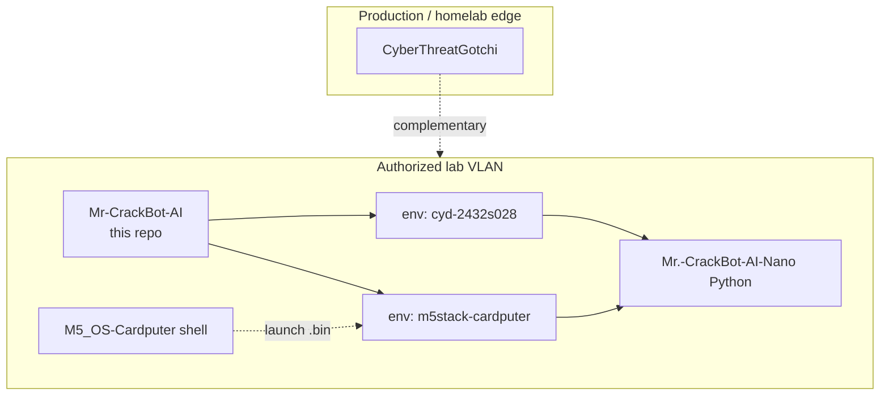

# Architecture — Mr. CrackBot AI (unified firmware)

## System context

## Module map

| Module | Path | Responsibility |
|--------|------|----------------|
| **types** | `include/crackbot/types.h` | `NetworkInfo`, shared structs |
| **config** | `include/crackbot/config.h` | SD paths, hostnames, portal defaults |
| **state** | `src/crackbot_core/state.cpp` | `gNetworks`, `gSelected`, deauth template |
| **ui_bridge** | `src/crackbot_core/ui_bridge.cpp` | Platform-agnostic status/line/clear hooks |
| **lab_wifi** | `src/crackbot_lab/lab_wifi.cpp` | Scan, deauth, handshake, crack orchestration |
| **lab_password** | `src/crackbot_lab/lab_password.cpp` | Heuristic + AI-style guesses, RockYou |
| **lab_ble_esp** | `src/crackbot_lab/lab_ble_esp.cpp` | CYD classic BLE stack |
| **lab_ble_nimble** | `src/crackbot_lab/lab_ble_nimble.cpp` | Cardputer NimBLE stack |
| **lab_portal_async** | `src/crackbot_lab/lab_portal_async.cpp` | CYD AsyncWebServer captive portal |
| **lab_portal_sync** | `src/crackbot_lab/lab_portal_sync.cpp` | Cardputer WebServer portal |
| **lab_ota** | `src/crackbot_lab/lab_ota.cpp` | ArduinoOTA shared |
| **menu_actions** | `src/crackbot_ui/menu_actions.cpp` | Shared action dispatch |
| **cyd_app** | `src/platform/cyd/cyd_app.cpp` | TFT touch grid, WiFiManager, intro |
| **cardputer_app** | `src/platform/cardputer/cardputer_app.cpp` | QWERTY menu, M5Cardputer display |

## Build matrix

| Environment | MCU | Excluded sources |
|-------------|-----|------------------|
| `cyd-2432s028` | ESP32 | `platform/cardputer/`, `lab_ble_nimble.cpp`, `lab_portal_sync.cpp` |
| `m5stack-cardputer` | ESP32-S3 | `platform/cyd/`, `lab_ble_esp.cpp`, `lab_portal_async.cpp` |

## Ecosystem links (salvadordata)

| Repo | Role |
|------|------|
| [cyberThreatGotchi](https://github.com/salvadordata/cyberThreatGotchi) | Edge defense |
| [Mr.-CrackBot-AI-Nano](https://github.com/salvadordata/Mr.-CrackBot-AI-Nano) | Jetson bench + STLs |
| [M5_OS-Cardputer](https://github.com/salvadordata/M5_OS-Cardputer) | Cardputer OS + app launcher |
| **Mr-CrackBot-AI** (this repo) | Unified CYD + Cardputer C++ firmware |

## SD layout (FAT32)

| Path | Content |
|------|---------|
| `/rockyou.txt` | Kali classic rockyou (~134 MB on SD) |
| `/rockyou2024.txt` | Operator lab **subset** only (not full 160 GB dump) |
| `/wordlists/rockyou2024.txt` | Alternate rockyou2024 path |
| `/checkpoint.txt` | Wordlist resume offset |
| `/networks.json` | Scan snapshot |
| `/export.json` | Full export bundle |
| `/handshake.log` | Capture audit |
| `/deauth.log` | Deauth audit |
| `/eavesdrop_log.txt` | BLE log |
| `/portal_creds.json` | Portal lab captures |

Encrypt exports at rest outside the lab VLAN.
